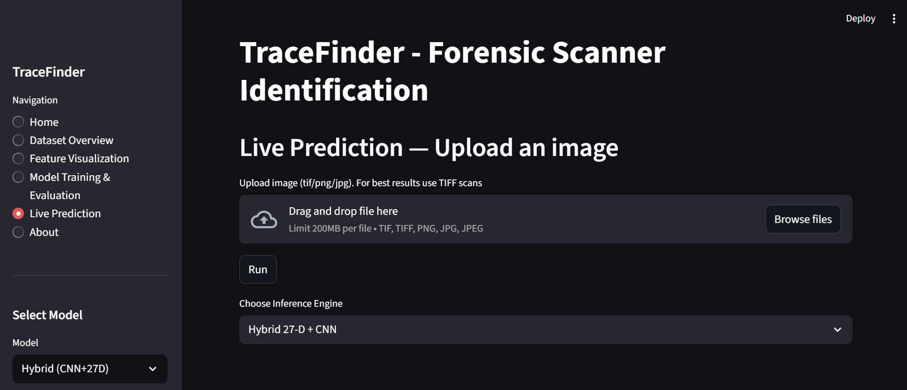

🧠 AI TraceFinder – A Forensic Approach to Detect Forged Scans

Detecting document forgery and identifying scanner origins using AI-driven noise fingerprint analysis.

📖 Overview

In today’s digital world, even scanned documents can be forged.
A fake certificate, a copied signature, or an altered legal paper can look completely real — but not to AI.

AI TraceFinder is a personal forensic AI project designed to detect hidden scanner fingerprints.
It identifies which scanner device created a scanned image and determines whether the image was tampered or manipulated.

The goal is simple — bring forensic-level trust and authenticity to scanned documents.

🔍 What It Actually Does

Every scanner leaves a unique “invisible signature” —
tiny electrical noise, subtle texture differences, and compression artifacts.

AI TraceFinder reads these patterns using machine learning and deep learning models to:

Identify which scanner brand/model generated a scanned document

Detect if the scanned image was edited, copied, or forged

Verify the authenticity of digital evidence

Think of it like a fingerprint scanner, but for scanners.

🛠️ Tech Behind the Project
Layer	Tools Used	Purpose
Language	Python 3.x	Core development
Machine Learning	Scikit-learn (SVM, Random Forest)	Baseline scanner classification
Deep Learning	TensorFlow / Keras	CNN & hybrid models
Image Processing	OpenCV, Scikit-Image	Noise extraction & preprocessing
Data Handling	NumPy, Pandas	Feature matrix & metadata management
Visualization	Matplotlib, Seaborn	Confusion matrices, plots
UI Framework	Streamlit	Interactive prediction dashboard
Version Control	Git + GitHub	Source and version management
⚙️ How the System Works
🧩 Preprocessing

Converts the image to grayscale and normalizes intensity

Extracts residual noise using wavelet transforms

🔬 Feature Extraction

Captures texture-based features like LBP, FFT energy, and contrast variance

🧠 Model Training

Trains SVM and Random Forest models on extracted features

Trains CNN to directly learn image patterns

Combines both into a Hybrid CNN+SVM model for balanced performance

🔍 Prediction Phase

Upload an image → choose model → get predicted scanner identity + tamper label

📊 Visualization

Displays class confidence, confusion matrices, and evaluation metrics

📸 Demo & Interface Preview

Here’s a quick look at the AI TraceFinder web app — designed for scanner source identification and tamper detection.

🏠 Home Dashboard

Displays dataset insights such as image count, scanner classes, and DPI levels.

🤖 Live Prediction Page

Upload a scanned image (TIFF, PNG, JPG) → Select a model (Baseline / CNN / Hybrid 27D+CNN) → Get real-time predictions.

📂 Project Structure
AI_TraceFinder/
│
├── app.py                     # Streamlit web app
├── dataset/
│   ├── Official/              # Core scanner images
│   ├── flatfield/             # Flatfield reference scans
│   ├── wiki dataset/          # Extended dataset
│   └── Tampered images/       # Forged samples + models
│       └── tamper_models/     # Patch-level & image-level classifiers
│
├── models/                    # Trained ML models (SVM, RF)
├── processed_data/            # Extracted features & CSVs
├── hybrid_cnn/                # CNN + Hybrid model training scripts
├── scr/                       # Baseline & preprocessing modules
├── results/                   # Evaluation results
└── requirements.txt           # Python dependencies

🎨 Streamlit App Features

🧠 Choose Model → Baseline / CNN / Hybrid

📸 Upload an Image → Instant scanner prediction

🧩 Tamper Detection → Identify manipulated areas

📊 Evaluate → View confusion matrix & accuracy

📈 Explore Dataset → Visualize scanners & DPI distributions

🧪 Performance Snapshot
Model	Accuracy	Highlights
Hybrid CNN	~82%	Strong balance between accuracy & interpretability
SVM	~75%	Effective for structured metadata features
Random Forest	~73%	Reliable baseline performance
Tamper Classifier	Active	Detects splicing, copy-move, and retouching
🚀 Run It Yourself

Tested on Python 3.10 (Windows 11)

# 1️⃣ Clone the repository
git clone https://github.com/parthh-21/AI_TraceFinder.git
cd AI_TraceFinder

# 2️⃣ Create virtual environment
python -m venv .venv
.venv\Scripts\activate

# 3️⃣ Install dependencies
pip install -r requirements.txt

# 4️⃣ Launch Streamlit app
streamlit run app.py

Your web app will start at:
👉 http://localhost:8501

💡 What I Learned Building This

This project taught me much more than coding — it taught me structure, debugging, and persistence.

Key learnings:

Extracting PRNU-based scanner noise fingerprints

Designing and comparing ML vs CNN vs Hybrid approaches

Building an interactive Streamlit UI

Handling large datasets & complex folder structures

Using Git & GitHub effectively for version control

🔮 Future Improvements

🔍 Grad-CAM visualization for CNN explainability

☁ API deployment for forensic & law-enforcement tools

🧠 Dataset expansion with camera & mobile scans

🖋 Signature / watermark forgery detection module

🚀 Cloud-based model hosting (AWS / GCP)

👨‍💻 About Me

Parth Gomase
🎓 B.Tech (Electronics & Telecommunication)
🏫 Rajarshi Shahu College of Engineering, Pune

🔗 GitHub: parthh-21

📜 License

Licensed under the MIT License —
You are free to use, modify, and build upon this project for learning or research purposes.

⭐ If this project inspired you or helped your learning, give it a star on GitHub!